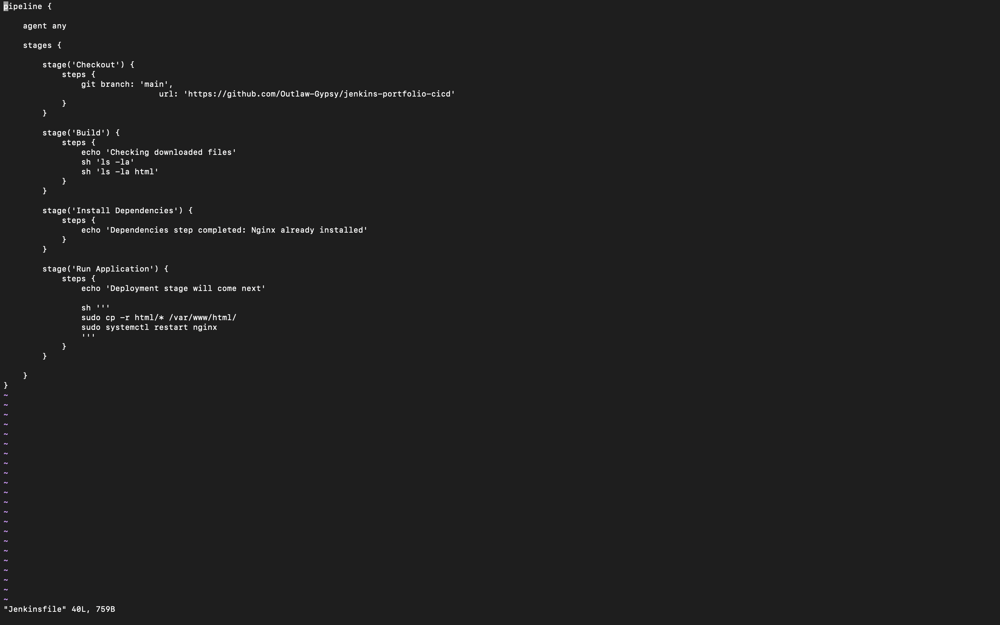
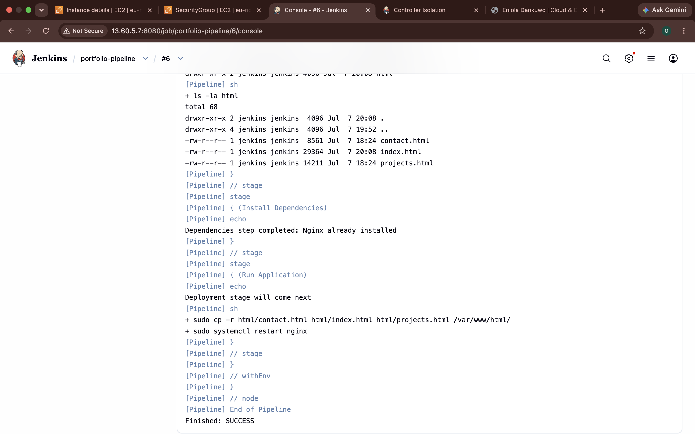
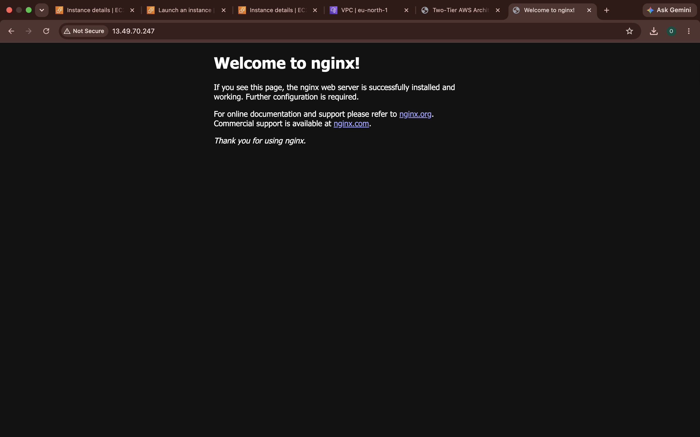
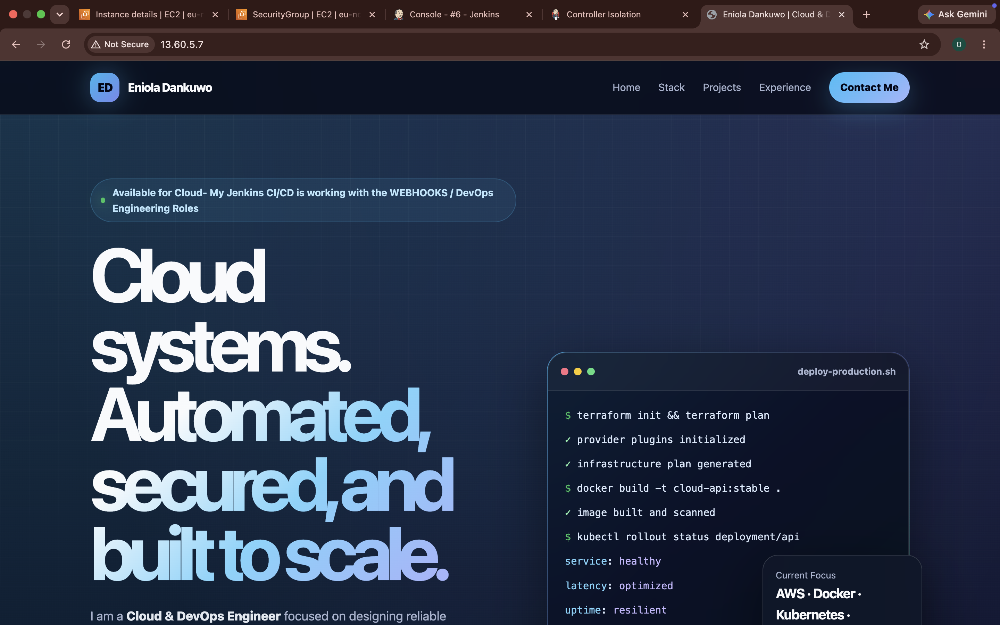
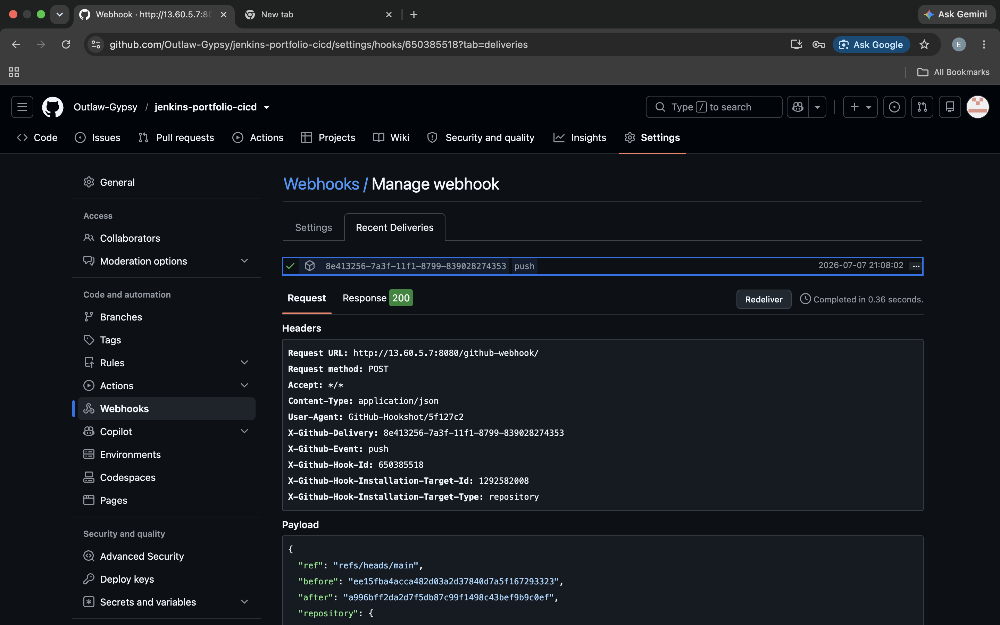

# CI/CD Pipeline for Portfolio Website Using Jenkins

## Project Overview

This project demonstrates the implementation of a Continuous Integration and Continuous Deployment (CI/CD) pipeline for deploying a static portfolio website.

The goal of this project was to automate the process of updating a portfolio website hosted on an AWS EC2 instance whenever changes were pushed to the GitHub repository.

The CI/CD workflow uses:

- GitHub for source code management
- Jenkins as the automation server
- AWS EC2 as the deployment server
- Nginx as the web server hosting the portfolio website

---

# Stage 1: Project Preparation and Initial Setup

## 1. Portfolio Website Preparation

Before setting up Jenkins, the portfolio website was created and prepared for deployment.

The portfolio files were organized into a project directory containing the HTML files required for the website.

The project structure was prepared as follows:
```text
portfolio-project/
│
├── html/
│   ├── index.html
│   ├── projects.html
│   ├── contact.html
│   └── other website assets
│
└── README.md
```
The `html` directory was created to store the website files that would later be deployed to the Nginx web server directory:
```text
/var/www/html
```

---

## 2. Creating the GitHub Repository

A new GitHub repository was created to store the portfolio project and Jenkins configuration files.

The repository would later contain:
```text
ec2-portfolio-jenkins/
│
├── html/
│   ├── index.html
│   ├── projects.html
│   └── contact.html
│
├── Jenkinsfile
│
└── README.md
```
The project was initialized locally using Git:

```bash
git init
```

The website files were added:
```bash
git add .
```
A commit was created:
```bash
git commit -m "add portfolio website files"
```
The local repository was connected to GitHub and pushed:
```bash
git push
```

## Stage 1 Summary

At the end of this stage:
	•	The portfolio website files were prepared.
	•	The project was organized into a GitHub repository.
	•	The HTML files were pushed to GitHub.
	•	The repository became the source location Jenkins would later use to retrieve the website files.

The completed flow at this stage was:
```text
Developer Machine
        |
        |
        | git push
        ↓
GitHub Repository
        |
        |
        ↓
Portfolio Source Code Stored
```

---

## Stage 2: Provisioning and Configuring the AWS EC2 Server

### Objective

Provision an Ubuntu EC2 instance that will host both Jenkins and the Nginx web server.

⸻

### 1. Update the Package Repository

After successfully connecting to the EC2 instance through SSH, the package repository was updated to ensure the latest package information was available.
```bash
sudo apt update
```
It is good practice to update the package repository before installing any software to ensure the latest versions and security updates are available.

### 2. Install Java and Jenkins
Go to Jenkins documentation and follow the prompt to install Java and Jenkins on your EC2 server after you SSH into the server.
Check the versions of of the Java and Jenkins downloaded.
```bash
java --version
jenkins --version
```

### 3. Start and Enable Jenkins
Start the Jenkins service:
```bash
sudo systemctl start jenkins
```
Enable Jenkins to start automatically whenever the EC2 instance boots:
```bash
sudo systemctl enable jenkins
```
Verify that Jenkins is running:
```bash
sudo systemctl status jenkins
```
Expected status:
```bash
Active: active (running)
```

### 4. Configure the Security Group for Jenkins
To access the Jenkins web interface from a browser, port 8080 was added to the EC2 Security Group.
This allows access using:
```text
http://<EC2_PUBLIC_IP>:8080
```

### 5. Unlock Jenkins

After opening Jenkins in the browser for the first time, Jenkins displayed the Unlock Jenkins page.

The initial administrator password was retrieved from the server:

```bash
sudo cat /var/lib/jenkins/secrets/initialAdminPassword
```
The password was copied and pasted into the Jenkins setup page to continue the installation.

### 6. Install Jenkins Plugins

After unlocking Jenkins, the recommended plugins were installed.

Additional plugins required for this project were also installed.

The following plugins were installed:
	•	Git
	•	Pipeline
	•	Blue Ocean
	•	Docker Pipeline

These plugins provide the features required to build CI/CD pipelines, integrate with GitHub, and visualize pipeline execution.

## Stage 2 Summary

At the end of this stage:
	•	The Ubuntu package repository was updated.
	•	Java was installed.
	•	Jenkins was installed successfully.
	•	Jenkins was configured to start automatically.
	•	Port 8080 was opened for browser access.
	•	Jenkins was unlocked.
	•	Required Jenkins plugins were installed.

The architecture at the end of this stage was:
```text
Developer Machine
        |
        | SSH
        ↓
Ubuntu EC2 Instance
        |
        ├── Java
        ├── Jenkins
        └── Required Plugins Installed
```

---

## Stage 3: Creating and Configuring the Jenkins Pipeline

### Objective

Create a Jenkins Pipeline job that retrieves the pipeline definition from the GitHub repository and executes it automatically.

⸻

### 1. Create a New Pipeline Job

After successfully installing Jenkins, a new Pipeline job was created.

From the Jenkins Dashboard:
```text
Dashboard
    └── New Item
            └── Pipeline
```
A name was assigned to the pipeline project before creating it.

### 2. Prepare the GitHub Repository

Before configuring Jenkins, the GitHub repository was updated to include the files required for the pipeline.

The repository structure became:
```text
ec2-portfolio-jenkins/
│
├── html/
│   ├── index.html
│   ├── projects.html
│   ├── contact.html
│   └── other website assets
│
├── Jenkinsfile
│
└── README.md
```
The Jenkinsfile was added to the root of the repository because Jenkins searches for this file when executing a Pipeline job.

The updated project was committed and pushed to GitHub.

```bash
git add .
git commit -m "Add Jenkinsfile"
git push
```

### 3. Configure the Pipeline

Inside the Jenkins Pipeline job configuration:

### Definition

The pipeline definition was changed from:
```text
Pipeline Script
```
to:
```text
Pipeline script from SCM
```
This instructs Jenkins to retrieve the pipeline configuration directly from the GitHub repository instead of storing it inside Jenkins.

----

### SCM
The Source Code Management (SCM) option was set to:
```text
Git
```

### Repository URL
The HTTPS URL of the GitHub repository was entered.

Example:
```text
https://github.com/<username>/<repository>.git
```
This tells Jenkins where the project source code is located.

⸻

### Branch

The branch to build was configured as:
```text
*/main
```
This ensures Jenkins always retrieves the latest code from the main branch.

⸻

### Script Path

The script path remained as:
```text
Jenkinsfile
```
Since the Jenkinsfile was stored in the root directory of the repository, no additional path configuration was required.

⸻

## 4. Create the Initial Jenkinsfile

An initial Jenkinsfile was created containing the required pipeline stages.

The first version of the pipeline focused on confirming that Jenkins could successfully execute each stage before implementing the actual deployment logic.

The stages created were:
	•	Checkout
	•	Build
	•	Install Dependencies
	•	Run Application

Initially, these stages displayed simple messages using the echo command to verify that the pipeline executed correctly.

⸻

## 5. Push the Jenkinsfile to GitHub

After creating the Jenkinsfile locally, it was committed and pushed to GitHub.
```bash
git add .
git commit -m "Create initial Jenkins pipeline"
git push
```
Once the changes reached GitHub, Jenkins was able to retrieve the pipeline definition directly from the repository.

⸻

## 6. Troubleshooting Pipeline Execution

Problem

The first pipeline execution remained in the following state:
```text
Waiting for next available executor
```
No stages were executed.

⸻

### Investigation

The Built-in Node status was inspected.

The node was found to be Offline.

Jenkins reported the following message:
```text
Reason: Disk space is below threshold of 1.00 GiB.
Only approximately 450 MiB was available on /tmp.
```
Although the root filesystem had sufficient free space, Jenkins monitors the available space on the /tmp filesystem separately.

Because the available space on /tmp was below Jenkins’ configured threshold, Jenkins automatically marked the Built-in Node as offline.

⸻

### Solution

The Jenkins Disk Space Monitor thresholds were reduced from:
```text
1.00 GiB
```
to:
```text
100 MiB
```
After saving the new threshold values, the Built-in Node returned online and the pipeline executed successfully.

⸻

## 7. Verify Pipeline Execution

The pipeline was executed manually using:
```text
Build Now
```
The build completed successfully and all pipeline stages executed without errors.

This confirmed that:
	•	Jenkins could access GitHub.
	•	Jenkins could retrieve the Jenkinsfile.
	•	Jenkins could execute Pipeline stages successfully.

⸻

### Stage 3 Summary

At the end of this stage:
	•	A Jenkins Pipeline job was created.
	•	Jenkins was configured to retrieve the Jenkinsfile from GitHub.
	•	The initial pipeline stages were implemented.
	•	A Built-in Node issue caused by the Disk Space Monitor was identified and resolved.
	•	The first successful Jenkins pipeline execution was completed.

The architecture at the end of this stage was:
```text
Developer
    |
    | git push
    ↓
GitHub Repository
    |
    | Pipeline script retrieved
    ↓
Jenkins
    |
    ↓
Checkout
    ↓
Build
    ↓
Install Dependencies
    ↓
Run Application
```

----

## Stage 4: Building the Deployment Pipeline

### Objective

Transform the initial Jenkins Pipeline from a demonstration pipeline into a functional Continuous Deployment pipeline capable of deploying the portfolio website to the Nginx web server.

⸻

### 1. Verify Repository Checkout

The first improvement to the pipeline was ensuring that Jenkins could successfully retrieve the latest version of the project from GitHub.

The Checkout stage was updated to clone the GitHub repository.

```groovy
stage('Checkout') {
    steps {
        git branch: 'main',
            url: 'https://github.com/<username>/<repository>.git'
    }
}
```
This ensured that every pipeline execution downloaded the latest source code from the main branch.

⸻

### 2. Verify the Downloaded Files

Before deploying the website, the pipeline was updated to confirm that Jenkins had successfully downloaded the project files.

The Build stage was modified to display the repository contents.

```groovy
stage('Build') {
    steps {
        echo 'Checking downloaded files'
        sh 'ls -la'
        sh 'ls -la html'
    }
}
```
This verified that the repository contained:

```text
html/
├── index.html
├── projects.html
├── contact.html
└── other website assets
```
This step prevented deployment attempts when the required files were missing.

----

### 3. Verify the Nginx Web Server

The EC2 instance was inspected to verify that Nginx was already installed.

The website directory was checked:

```bash
ls -la /var/www/html
```
Initially, the directory contained only the default Nginx page:

```text
index.nginx-debian.html
```
This confirmed that the portfolio website had not yet been deployed.

⸻

### 4. Verify Jenkins Permissions

Since Jenkins executes the pipeline as the jenkins user instead of the ubuntu user, it was necessary to verify that Jenkins could execute administrative commands.

The Jenkins user information was checked.

```bash
id jenkins
```
Output:

```text
uid=105(jenkins)
gid=109(jenkins)
groups=109(jenkins),27(sudo)
```
A passwordless sudo test was then performed.

```bash
sudo -u jenkins sudo -n ls /root
```
The successful output confirmed that Jenkins could execute sudo commands without requiring a password.

This was necessary because the deployment stage would execute privileged commands.

⸻

### 5. Create the Deployment Stage

The placeholder deployment stage was replaced with commands that deployed the website.

```groovy
stage('Run Application') {
    steps {
        echo 'Deploying website to Nginx'

        sh '''
        sudo cp -r html/* /var/www/html/
        sudo systemctl restart nginx
        '''
    }
}
```
### Screenshot


----

### 6. Understanding the Deployment Commands

The first command copies the portfolio website files into the Nginx document root.

```bash
sudo cp -r html/* /var/www/html/
```
This replaces the default Nginx content with the latest portfolio files downloaded from GitHub.

The second command restarts Nginx.

```bash
sudo systemctl restart nginx
```
Restarting Nginx causes the web server to immediately begin serving the updated website.

⸻

### 7. Commit and Push the Updated Pipeline

The updated Jenkinsfile was committed locally.

```bash
git add Jenkinsfile
git commit -m "Add deployment stage"
git push
```

----

### 8. Execute the Pipeline

The pipeline was executed manually using:

```text
Build Now
```

### Screenshot


The following stages completed successfully:
	•	Checkout
	•	Build
	•	Install Dependencies
	•	Run Application

The deployment stage copied the website files into:

```text
/var/www/html
```
and restarted the Nginx service.

⸻

### 9. Verify Deployment

The deployment was verified by opening the EC2 public IP address in a web browser.

Before deployment:

```text
Welcome to nginx!
```

### Screenshot


After deployment:

```text
Portfolio Website
```

### Screenshot


The default Nginx page had been successfully replaced by the portfolio website.

⸻

### Stage 4 Summary

At the end of this stage:
	•	Jenkins successfully cloned the latest project from GitHub.
	•	The downloaded project files were verified.
	•	Jenkins permissions were validated.
	•	The deployment stage copied the website files into the Nginx document root.
	•	Nginx was restarted automatically.
	•	The portfolio website became accessible through the EC2 public IP address.

The architecture at the end of this stage was:
```text
GitHub Repository
        |
        | Checkout
        ↓
Jenkins Workspace
        |
        | Verify Files
        ↓
html/
        |
        | Copy Files
        ↓
/var/www/html
        |
        | Restart Nginx
        ↓
Portfolio Website Available Through Browser
```

----

## Stage 5: Automating the Pipeline with GitHub Webhooks

### Objective

Eliminate the need to manually trigger Jenkins by configuring a GitHub Webhook that automatically starts the pipeline whenever code is pushed to the GitHub repository.

⸻

### 1. Configure the Jenkins Build Trigger

The Jenkins Pipeline job was opened for configuration.

Navigation:

```text
Dashboard
    └── Portfolio Pipeline
            └── Configure
```
Under Build Triggers, the following option was enabled:

```text
GitHub hook trigger for GITScm polling
```
This allows GitHub to notify Jenkins immediately whenever a push event occurs.

⸻

### 2. Configure the GitHub Webhook

The GitHub repository was opened.

Navigation:

```text
Repository
    └── Settings
            └── Webhooks
                    └── Add webhook
```
The webhook was configured using the following settings.

```text
Payload URL:
http://<EC2_PUBLIC_IP>:8080/github-webhook/

Content Type:
application/json

Secret:
Not configured

SSL Verification:
Enabled

Events:
Just the push event

Active:
Enabled
```
This configuration allows GitHub to notify Jenkins every time new commits are pushed to the repository.

⸻

### 3. Verify Network Accessibility

For GitHub to communicate with Jenkins, the EC2 Security Group had to allow incoming traffic on port 8080.

The following inbound rule was verified.

```text
Type:       Custom TCP
Protocol:   TCP
Port:       8080
Source:     0.0.0.0/0
Purpose:    Allow access to the Jenkins web interface and receive GitHub Webhook requests.
```
Without this rule, GitHub would be unable to deliver webhook requests to Jenkins.

⸻

### 4. Test Automatic Pipeline Execution

To verify the webhook configuration, a small change was made to the portfolio website.

For example, a minor update was made to the index.html file.

The changes were committed and pushed.

```bash
git add .
git commit -m "Test GitHub webhook"
git push
```
Unlike previous tests, Build Now was not clicked manually.

Instead, GitHub automatically notified Jenkins of the new commit.

⸻

### 5. Automatic Pipeline Execution

After the git push command completed, Jenkins automatically started a new pipeline execution.

The pipeline executed the following stages without any manual intervention.

```text
Checkout
    ↓
Build
    ↓
Install Dependencies
    ↓
Run Application
```
This confirmed that the webhook was functioning correctly.

### Screenshot

⸻

### 6. Automatic Website Deployment

During the deployment stage, Jenkins:
	•	Downloaded the latest version of the repository.
	•	Copied the updated portfolio files into the Nginx web directory.
	•	Restarted the Nginx service.

The website was updated automatically without:
	•	Opening Jenkins.
	•	Clicking Build Now.
	•	Connecting to the EC2 instance through SSH.
	•	Manually copying files.

⸻

### 7. Verify Successful Deployment

The EC2 Public IP address was opened in a web browser.

The recently modified portfolio content appeared immediately after the pipeline completed successfully.

This confirmed that the complete Continuous Deployment workflow was functioning as intended.

⸻

## Complete CI/CD Workflow

The completed workflow is illustrated below.

```text
Developer
    |
    | Edit Website
    |
    | git add .
    | git commit
    | git push
    ↓
GitHub Repository
    |
    | Push Event
    ↓
GitHub Webhook
    |
    ↓
Jenkins Pipeline
    |
    ├── Checkout Source Code
    ├── Verify Project Files
    ├── Deploy Website
    └── Restart Nginx
    |
    ↓
EC2 Server
    |
    ↓
Nginx
    |
    ↓
Updated Portfolio Website
```

----

## Stage 5 Summary

At the end of this stage:
	•	GitHub Webhooks were configured successfully.
	•	Jenkins was configured to listen for webhook events.
	•	Every git push automatically triggered the Jenkins Pipeline.
	•	The portfolio website was deployed without any manual intervention.
	•	A complete Continuous Integration and Continuous Deployment (CI/CD) pipeline was successfully implemented.

The final architecture of the project became:

```text
Developer Machine
        |
        | git push
        ↓
GitHub Repository
        |
        | Webhook Notification
        ↓
Jenkins
        |
        | Checkout
        | Build
        | Deploy
        ↓
EC2 Instance
        |
        ↓
Nginx Web Server
        |
        ↓
Portfolio Website
```

----

## Final Project Workflow

The complete CI/CD workflow implemented in this project is illustrated below.

```text
Developer
    │
    │ Modify Portfolio Website
    │
    │ git add .
    │ git commit -m "Update portfolio"
    │ git push
    ▼
GitHub Repository
    │
    │ Stores the latest source code
    │
    ▼
GitHub Webhook
    │
    │ Automatically notifies Jenkins of the new push
    ▼
Jenkins Pipeline
    │
    ├── Checkout
    │      Downloads the latest source code
    │
    ├── Build
    │      Verifies that the required project files exist
    │
    ├── Install Dependencies
    │      Ensures the deployment environment is ready
    │
    ├── Run Application
    │      Copies the portfolio files to the Nginx web directory
    │      Restarts the Nginx service
    │
    ▼
AWS EC2 Instance
    │
    ▼
Nginx Web Server
    │
    ▼
Updated Portfolio Website
```

----

## Project Structure

The final project repository is organized as follows.

```text
ec2-portfolio-jenkins/
│
├── .github/
│   └── (Optional future GitHub workflows)
│
├── html/
│   ├── index.html
│   ├── projects.html
│   ├── contact.html
│   └── other website assets
│
├── Jenkinsfile
├── README.md
└── troubleshooting.md
```

----

## Pipeline Stages Explained

### Checkout

The Checkout stage connects to the GitHub repository and downloads the latest version of the project into the Jenkins workspace.

Without this stage, Jenkins would not have access to the latest source code.

⸻

### Build

The Build stage verifies that the project files were downloaded successfully.

In this project, the stage lists the project files and confirms that the required HTML files exist before deployment.

⸻

### Install Dependencies

The Install Dependencies stage prepares the deployment environment.

Although Nginx had already been installed during the server setup, this stage demonstrates where project dependencies would normally be installed in a production CI/CD pipeline.

⸻

### Run Application

The Run Application stage performs the deployment.

During this stage, Jenkins:
	•	Copies the website files from the repository into the Nginx web directory.
	•	Restarts the Nginx service.
	•	Makes the updated website immediately available through the browser.

This is the deployment stage of the pipeline.

----

## Challenges Encountered

During the implementation of this project, several technical challenges were encountered. Each issue provided valuable insight into troubleshooting CI/CD pipelines and cloud infrastructure.

⸻

### 1. GitHub Personal Access Token Permission Error

### Challenge

While pushing the repository to GitHub after creating the Jenkinsfile, Git rejected the push with an error indicating that the Personal Access Token (PAT) did not have permission to create or update workflow files.

### Cause

The existing Personal Access Token did not include the required workflow permission.

### Resolution

A new Personal Access Token was generated with the required permissions, including the workflow scope. The Git credentials were updated, after which the repository was pushed successfully.

⸻

### 2. Unable to Connect to the EC2 Instance Through SSH

### Challenge

The initial SSH connection to the EC2 instance timed out even though the instance was running.

### Cause

The subnet route table was not associated with an Internet Gateway, preventing internet traffic from reaching the EC2 instance.

### Resolution

The route table was updated with a default route (0.0.0.0/0) pointing to the Internet Gateway. After the update, SSH connectivity was restored.

⸻

### 3. Jenkins Installation Failure

### Challenge

During the Jenkins installation, Ubuntu reported that the Jenkins repository was not signed and the package could not be installed.

### Cause

The Jenkins repository signing key was not trusted by the operating system.

Resolution

The Jenkins signing key was imported correctly, the package repository was refreshed, and Jenkins was installed successfully.

⸻

### 4. Jenkins Pipeline Stuck Waiting for an Executor

### Challenge

The first pipeline execution remained in the Waiting for next available executor state.

### Cause

The Jenkins Built-in Node had been automatically marked offline because the available disk space on the /tmp filesystem was below Jenkins’ configured threshold.

### Resolution

The Disk Space Monitor threshold was reduced from 1 GiB to 100 MiB, allowing the Built-in Node to return online and execute the pipeline.

⸻

### 5. Deploying Files to the Nginx Directory

### Challenge

The portfolio website could not initially be deployed because Jenkins required permission to copy files into the Nginx web directory.

### Cause

The deployment directory (/var/www/html) is owned by the root user, while Jenkins executes the pipeline as the jenkins user.

### Resolution

The Jenkins user permissions were verified to ensure it could execute sudo commands without requiring a password. This allowed Jenkins to copy the website files and restart the Nginx service successfully.

⸻

### 6. Configuring Automatic Pipeline Execution

### Challenge

Initially, every deployment required manually clicking Build Now in Jenkins.

### Cause

No GitHub Webhook had been configured to notify Jenkins of new commits.

### Resolution

A GitHub Webhook was configured to send push events to Jenkins. The Jenkins Pipeline was also configured to listen for GitHub webhook events. After the configuration, every git push automatically triggered the pipeline.

----

## Lessons Learned

This project provided practical experience with implementing a complete CI/CD pipeline using Jenkins.

The following concepts were learned during the project:
	•	Provisioning and configuring an AWS EC2 instance.
	•	Connecting securely to a remote server using SSH.
	•	Installing and configuring Jenkins on Ubuntu.
	•	Creating Jenkins Pipeline jobs using a Jenkinsfile.
	•	Integrating Jenkins with GitHub repositories.
	•	Deploying static websites using Nginx.
	•	Automating deployments with GitHub Webhooks.
	•	Troubleshooting authentication, networking, permissions, and Jenkins node issues.
	•	Understanding the complete Continuous Integration and Continuous Deployment workflow from source code commit to production deployment.

⸻

## Future Improvements

The current implementation provides a functional CI/CD pipeline for deploying a static portfolio website.

Future enhancements may include:
	•	Adding automated testing before deployment.
	•	Building and deploying the application inside Docker containers.
	•	Using separate development, staging, and production environments.
	•	Deploying to multiple EC2 instances using Jenkins agents.
	•	Integrating email or Slack notifications for build status.
	•	Implementing automated rollback in case of deployment failures.
	•	Securing Jenkins with HTTPS and authentication best practices.
	•	Managing infrastructure using Infrastructure as Code (IaC) tools such as Terraform.


